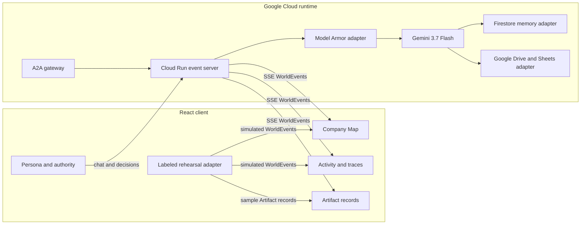

# CoOps architecture

CoOps gives each department a persistent Department Agent. Department Agents exchange typed Task Envelopes, delegate scoped work to Worker Agents, and route blocked work to the named person who owns the required Approval. The Event Log is the source for the Company Map, Activity, Documents, approvals, and replay.

## Execution rules

- Live mode opens the backend event stream and reports its exact Runtime Identity. It never substitutes rehearsal events when the backend is unavailable.
- Rehearsal mode runs only in the browser. Every scripted event carries `payload.simulated: true`.
- Rehearsal mode has two layers: the ambient company baseline is always-on product behavior, while optional authored rehearsals are discovered from `src/demos`. Removing every authored rehearsal leaves a valid ambient-only application.
- The server appends each event before broadcasting it. The client folds the ordered Event Log into the current world.
- An Approval can be resolved only by its named person. The server rejects duplicate decisions.
- Artifact provenance is explicit. Live content, rehearsal templates, and metadata-only deliveries cannot share the same presentation state.
- `src/evidence/runEvidence.ts` computes one Run Evidence record for the navigation rail and Activity. Those views cannot drift into different counts or runtime labels.
- Workspace writes pass through an adapter. The Runtime Identity says whether the active deployment uses Google Workspace or a dry run.

## Frontend delivery

The Company Map, navigation, and runtime status form the initial browser path. Secondary pages, side panels, command search, onboarding, the Artifact viewer, and the Valley map load on demand. The production build keeps the initial JavaScript chunk below Vite's 500 kB warning threshold.

## Judge path

1. Open the runtime inspector and confirm the model, memory, guardrail, workspace, A2A posture, revision, and run ID.
2. Start a live launch from the Company Map.
3. Follow the Task Envelope across departments and inspect the agent conversation.
4. Resolve the named human Approval and watch the run continue from its checkpoint.
5. Open Activity to inspect tool actions, guardrail blocks, the event trace, and measured latency.
6. Open the delivered Artifact and confirm its provenance and external location.
7. Replay the completed task from the Event Log.
